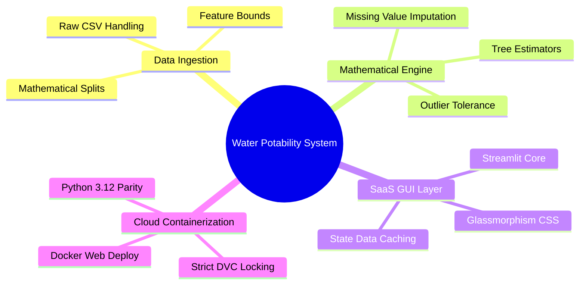
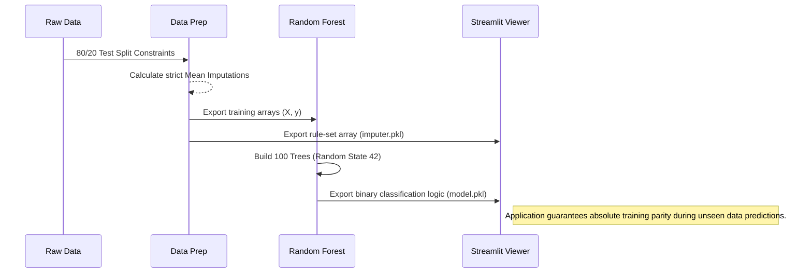
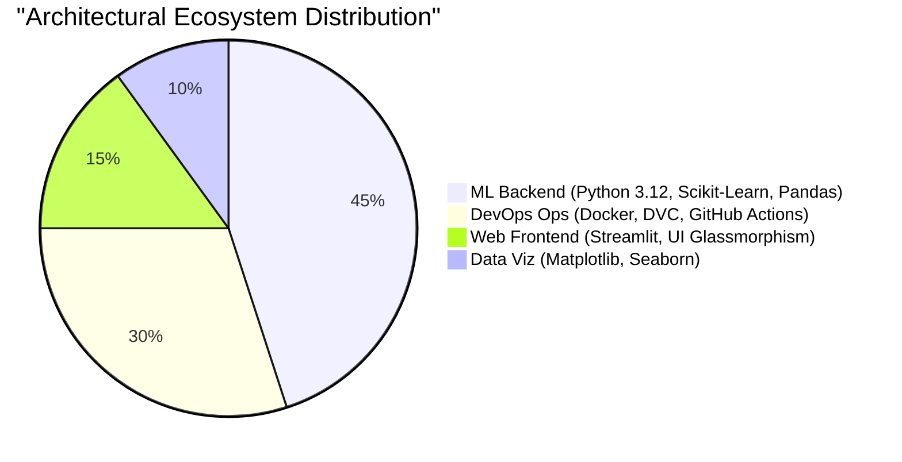
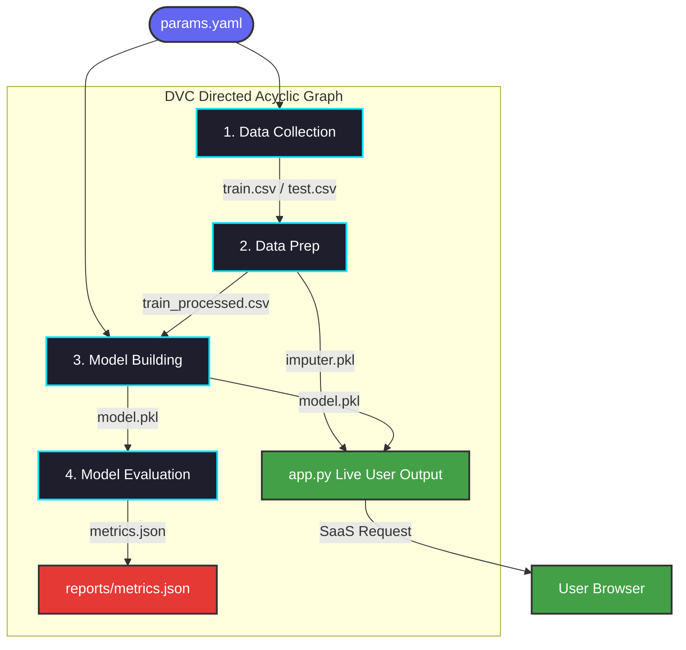

# 💧 Water Potability Prediction (MLOps)

A complete, production-grade Machine Learning pipeline and SaaS web application designed to predict human water potability based on 9 core water quality metrics. The project integrates **Data Version Control (DVC)** for absolute reproducibility, **Docker** for cloud deployment, and a premium **Streamlit Glassmorphic Dark UI**.

---

## Table of Contents
- [Project Overview](#project-overview)
- [Features](#features)
- [Tech Stack](#tech-stack)
- [MLOps Architecture](#mlops-architecture)
- [Installation](#installation)
- [Usage](#usage)
- [Configuration](#configuration)
- [SaaS Interface / Screenshots](#saas-interface--screenshots)
- [Testing & CI/CD](#testing--cicd)
- [Deployment](#deployment)
- [License](#license)

---

## Project Overview

### The Problem vs. The Solution
Analyzing raw chemical constraints (pH, Hardness, Trihalomethanes) from water sources using ad-hoc Jupyter Notebook scripts regularly leads to fatal **Data Leakage** and **Serialization Drift** during cloud deployment. Because ML variables drift natively over time, creating a robust, enterprise-ready environment requires strict Machine Learning Operations (MLOps). 

This project solves these architectural flaws natively by forcing a **Directed Acyclic Graph (DAG)** pipeline to manage the mathematical limits exactly synchronized across both the Training context and the Live UI Application inference context.



---

## Features

This ecosystem relies on a 4-tier capability structure natively preventing model-failures.

| Feature Category | Description | Benefit | Technology |
|---|---|---|---|
| **Deterministic Data Pipeline** | Enforces sequential execution parameters (Data Split $\rightarrow$ Train $\rightarrow$ Evaluate). | Automates redundant steps; absolutely secures model parameter drift. | **DVC** |
| **Data Leakage Immunity** | Imputation math (mean-averaging) is *strictly* bound to the `train.csv`. | Guarantees test sets and live-users do not influence machine-learning rules. | **Pandas & Scikit-learn** |
| **Decoupled Hyperparameters** | Tree limits (`n_estimators`) and seed bounds (`random_state`) are removed from scripts. | Changes instantly reflect across the graph via `params.yaml` tuning. | **YAML / PyYAML** |
| **SaaS Grade Interface** | Premium Glassmorphic Dark UI manipulating Streamlit `st.markdown`. | Delivers professional, aesthetic confidence bounds and analytics natively. | **Streamlit & CSS3** |

### Data Lifecycle Diagram


---

## Tech Stack

The technology ecosystem binds rigorous data-science dependencies natively toward cloud-ready enterprise integrations. 



- **Backend Context:** Natively forces **Python 3.12** structures securely scaling `scikit-learn==1.8.0` mapping through binary `.pkl` dumps to rapidly store classification arrays.
- **Frontend Context:** Streamlit harnesses real-time React-bindings cached heavily via `@st.cache_resource` executing rapid user inputs without looping the server payload.
- **DevOps Context:** `.github/workflows/ci.yml` strictly catches Python limits using `flake8` limiters (120 lines max) evaluating against `tox.ini` safety triggers natively before pushing to the central repository.

---

## MLOps Architecture

The overarching pipeline natively utilizes **Data Version Control (DVC)**.
Instead of raw files scattered across global folders, DVC defines mathematically rigorous input vs. output boundaries securely mapped across six distinct stages. 



**Architectural Deep-Dive:**
1. **Dynamic Execution (`dvc repro`)**: If you alter `n_estimators: 150` natively within `params.yaml`, analyzing the DAG immediately tells DVC that *Data Collection* and *Data Prep* do not need to be re-run since their initial inputs matched identically. DVC automatically jumps straight to **Stage 3**.
2. **MVC Web Architecture Bypass**: The live `app.py` UI physically cannot compute predictions accurately unless `imputer.pkl` and `model.pkl` structurally match. By tying these objects linearly into the DAG model outputs, testing-to-production logic gaps are mechanically eradicated.

---

## Installation

```bash
# Clone the repo
git clone https://github.com/DhruvGholap27/Water-Potability.git

# Navigate to project folder
cd Water-Potability

# Initialize Virtual Environment (Python 3.12+)
python -m venv venv

# Activate Environment (Windows)
.\venv\Scripts\activate
# Activate Environment (Mac/Linux)
source venv/bin/activate

# Install strictly pinned dependencies
pip install -r requirements.txt
```

---

## Usage

### 1. Rebuilding the Machine Learning Pipeline
To execute the end-to-end Machine Learning operations (Data Split $\rightarrow$ Preprocessing $\rightarrow$ Random Forest Build $\rightarrow$ JSON Evaluation):
```bash
dvc repro
```

### 2. Launching the SaaS Application
To view the front-end dashboard natively in your default browser on `localhost`:
```bash
streamlit run app.py
```

---

## Configuration
All machine learning constraints are centrally localized in **`params.yaml`**. Modifying these parameters signals DVC to autonomously re-train the model during the next execution:
```yaml
base:
  random_state: 42
data_collection:
  test_size: 0.2
model_building:
  n_estimators: 100
```

---

## SaaS Interface / Screenshots
The application's interface natively disables standard Streamlit layouts in favor of an upgraded Glassmorphic Dark-Mode aesthetic matching `[theme] base="dark"`.

- **Predict Water Quality:** A 9-slider input matrix rendering confidence intervals based strictly on WHO safety constants utilizing neon `.metric-card` CSS structures.
- **Data Exploration:** Live correlation heatmaps, box plots, and class-distribution pie charts natively cached via `@st.cache_data`.
- **Model Comparison:** Statistical breakdown proving `Random Forest (F1-Score)` superiority over `SVM` and `Logistic Regression` algorithms natively generating visual benchmarks.

---

## Testing & CI/CD
All commits pushed to the `master` repository automatically trigger the `.github/workflows/ci.yml` matrix.
- `tox` securely builds testing structures.
- `flake8` forces maximum Python line lengths (`max-line-length = 120`) intercepting bad syntax.
- **Python Versioning:** The pipeline forces **Python 3.12** environment locking to ensure mathematical parity natively against the exact `numpy==2.4.2` bindings deployed locally.

---

## Deployment
This project is mapped for instantaneous Cloud Service hosting (e.g. Render, AWS AppRunner) generating Native Docker OS limits.

```bash
# Target the built-in Dockerfile config
docker build -t water-potability .

# Run the container (Exposes Port 8501)
docker run -p 8501:8501 water-potability
```
*Note: Because `models/` is decoupled from GitHub tracking via `.gitignore`, the Docker configuration intelligently pulls your raw base code and calculates the 6-stage `dvc repro` exclusively inside the VM isolation natively before spinning up the Streamlit interface!*

---

## License
MIT License.
