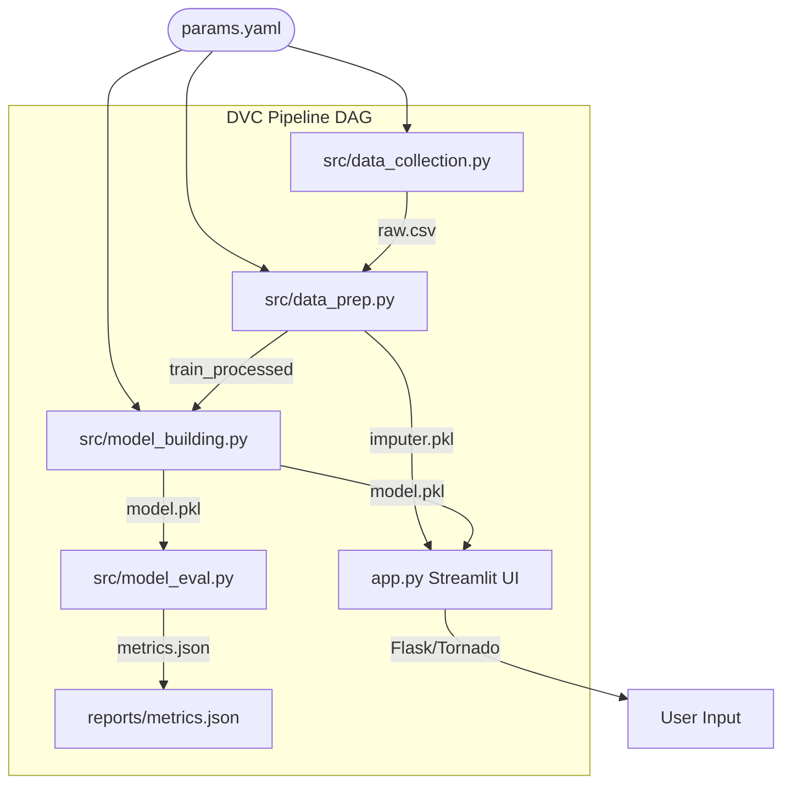

# 💧 Water Potability Prediction (MLOps)

A complete, production-grade Machine Learning pipeline and SaaS web application designed to predict human water potability based on 9 core water quality metrics. The project integrates **Data Version Control (DVC)** for absolute reproducibility, **Docker** for cloud deployment, and a premium **Streamlit Glassmorphic Dark UI**.

---

## Table of Contents
- [Project Overview](#project-overview)
- [Features](#features)
- [Tech Stack](#tech-stack)
- [Installation](#installation)
- [Usage](#usage)
- [Configuration](#configuration)
- [SaaS Interface / Screenshots](#saas-interface--screenshots)
- [MLOps Architecture](#mlops-architecture)
- [Testing & CI/CD](#testing--cicd)
- [Deployment](#deployment)
- [License](#license)

---

## Project Overview
This system processes raw chemical metrics (like pH, Hardness, and Conductivity) through a fully automated pipeline to classify water as `Potable (1)` or `Not Potable (0)`.

**Why it matters:**
Hardcoded Python notebooks suffer from *Data Leakage* and *Serialization Drift*. This repository solves those problems using an MLOps-driven **Directed Acyclic Graph (DAG)**. Real-world parameters dictate exactly how the data is split, imputed, scaled, trained, and saved as a `.pkl` binary hash before securely mounting inside a frontend Web Application.

---

## Features
- **Deterministic Pipeline (DVC):** Tracks dependencies and generates models sequentially to prevent redundant computations.
- **Data-Leakage Protection:** Mathematical limits (like mean-imputation) are calculated exclusively on the `train.csv` boundary and identically injected into the `app.py` live-inference engine.
- **Dynamic Hyperparameter Tuning:** Tree estimators and random seeds are decoupled from scripts into a centralized `params.yaml`.
- **Glassmorphic SaaS UI:** A sleek, dark-themed Streamlit interface customized with drop-shadow layers and native Material Icons.
- **Enterprise Containerization:** `Dockerfile` is uniquely optimized to trigger `dvc repro` inside the OS image securely isolating requirements logic.

---

## Tech Stack
- **Frontend / UI:** Streamlit, Custom HTML/CSS3
- **Backend ML:** Python 3.12, Scikit-Learn, Pandas, Numpy
- **Data Versioning / Pipeline:** DVC (Data Version Control)
- **Visualization:** Matplotlib, Seaborn
- **CI/CD & Virtualization:** GitHub Actions, Tox, Flake8, Docker

---

## Installation

```bash
# Clone the repo
git clone https://github.com/DhruvGholap27/Water-Potability.git

# Navigate to project folder
cd Water-Potability

# Initialize Virtual Environment (Python 3.12+)
python -m venv venv

# Activate Environment (Windows)
.\venv\Scripts\activate
# Activate Environment (Mac/Linux)
source venv/bin/activate

# Install strictly pinned dependencies
pip install -r requirements.txt
```

---

## Usage

### 1. Rebuilding the Machine Learning Pipeline
To execute the end-to-end Machine Learning operations (Data Split $\rightarrow$ Preprocessing $\rightarrow$ Random Forest Build $\rightarrow$ JSON Evaluation):
```bash
dvc repro
```

### 2. Launching the SaaS Application
To view the front-end dashboard on `localhost`:
```bash
streamlit run app.py
```

---

## Configuration
All machine learning constraints are centrally localized in **`params.yaml`**. Modifying these parameters signals DVC to autonomously re-train the model during the next execution:
```yaml
base:
  random_state: 42
data_collection:
  test_size: 0.2
model_building:
  n_estimators: 100
```

---

## SaaS Interface / Screenshots
The application's interface natively disables standard Streamlit layouts in favor of an upgraded Glassmorphic Dark-Mode aesthetic matching `[theme] base="dark"`.

- **Predict Water Quality:** A 9-slider input matrix rendering confidence intervals based strictly on WHO safety constants.
- **Data Exploration:** Live correlation heatmaps, box plots, and class-distribution pie charts natively cached via `@st.cache_data`.
- **Model Comparison:** Statistical breakdown proving `Random Forest (F1-Score)` superiority over `SVM` and `Logistic Regression`.

---

## MLOps Architecture



---

## Testing & CI/CD
All commits pushed to the `master` repository automatically trigger the `.github/workflows/ci.yml` matrix.
- `tox` securely builds testing structures.
- `flake8` forces maximum Python line lengths (`max-line-length = 120`) intercepting bad syntax.
- **Python Versioning:** The pipeline forces **Python 3.12** environment locking to ensure mathematical parity against the `numpy==2.4.2` and `scikit-learn==1.8.0` constraints.

---

## Deployment
This project is mapped for instantaneous Cloud Service hosting (e.g. Render, AWS AppRunner).

```bash
# Target the built-in Dockerfile config
docker build -t water-potability .

# Run the container (Exposes Port 8501)
docker run -p 8501:8501 water-potability
```
*Note: Because `models/` is decoupled from GitHub tracking via `.gitignore`, the Docker configuration intelligently downloads your codebase and calculates `dvc repro` exclusively inside the container before spinning up the Streamlit server.*

---

## License
MIT License.
