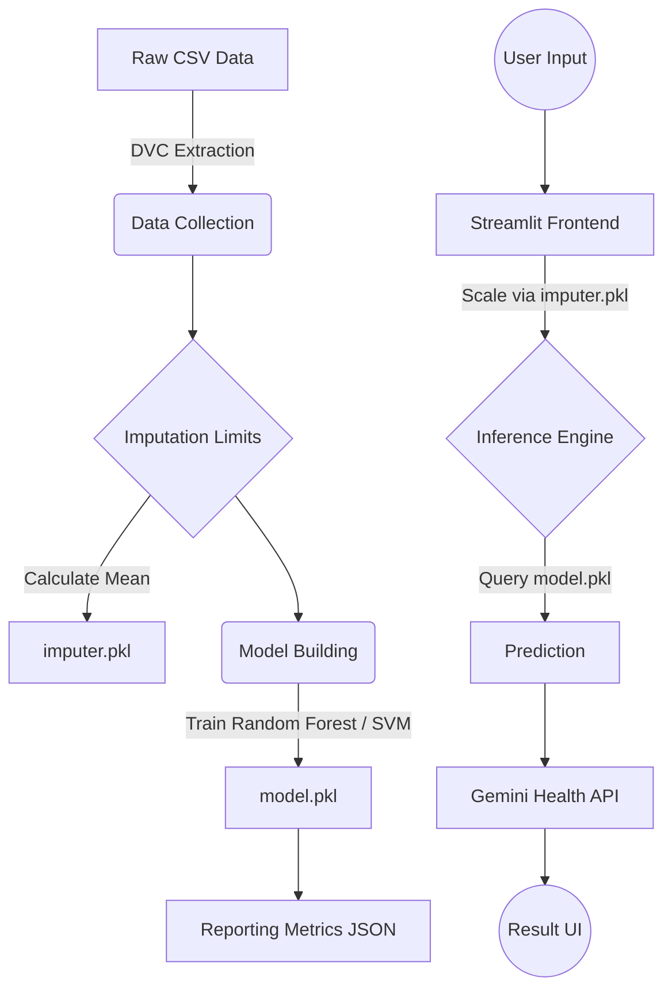
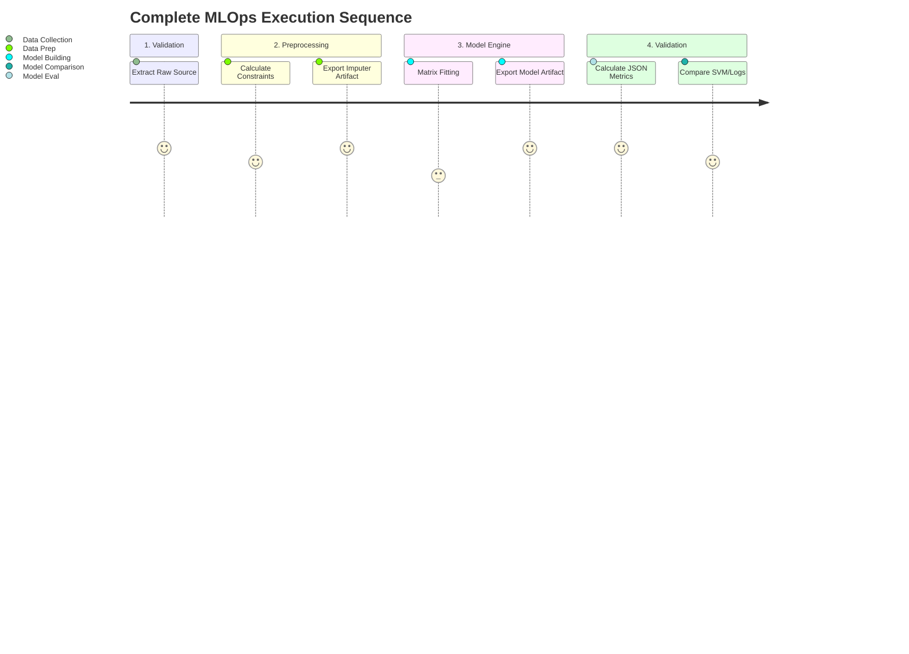
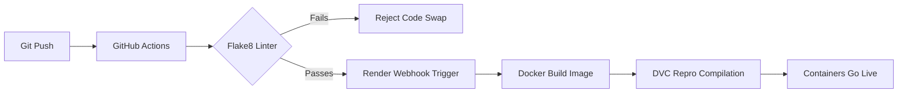

# 💧 Water Potability MLOps Platform

**Short Description:** An enterprise-grade, end-to-end Machine Learning Operations (MLOps) pipeline that predicts water potability based on chemical parameters. It features a deterministic DVC-tracked DAG, automated CI/CD execution via GitHub Actions, full Docker containerization, and a native Glassmorphism SaaS UI safely hosted on Render.com.

---

## 🔗 Table of Contents
- [📝 Project Overview](#-project-overview)
- [✨ Features](#-features)
- [🏗 Architecture](#-architecture)
- [📂 Folder Structure](#-folder-structure)
- [🛠 Technologies](#-technologies)
- [⚙️ Installation](#️-installation)
- [📝 Configuration](#-configuration)
- [🚀 Usage](#-usage)
- [🔄 Pipeline / Workflow](#-pipeline--workflow)
- [🧪 Testing](#-testing)
- [📊 Monitoring & Logging](#-monitoring--logging)
- [⚙️ CI/CD](#️-cicd)
- [🖥 Deployment](#-deployment)
- [🤝 Contributing](#-contributing)
- [📄 License](#-license)

---

## 📝 Project Overview

**Purpose and Motivation:** 
Access to safe drinking water is a critical global health necessity. Traditional water testing can be slow and expensive. This project serves as a scalable Machine Learning solution that instantly classifies water sources as potable or non-potable using easily measurable metrics (pH, Hardness, TDS, etc.), democratizing safety analysis.

- **Problem Being Solved:** Automating the prediction of water safety while strictly adhering to MLOps principles (preventing Data Leakage, ensuring Model Reproducibility, and automating Deployment).
- **Type of ML Problem:** Binary Classification (Supervised Learning).
- **Expected Outcome:** A globally accessible, zero-latency Web API that not only predicts potability with high precision but generates an AI-driven Health Narrative for the end-user.

---

## ✨ Features

- **Automated Data Preprocessing**: Dynamic handling of null values and outlier detection securely fitted exclusively to training arrays (Zero Data Leakage).
- **Model Orchestration**: Strict 6-stage Data Version Control (DVC) pipeline forcing sequential execution.
- **Algorithm Optimization**: Continuous evaluation between Random Forest, Support Vector Machines (SVM), and Logistic Regression algorithms.
- **Interactive UI/UX**: Custom-CSS Glassmorphism Dark Theme Interface built on Streamlit.
- **Generative AI Integration**: Gemini 2.5 Flash API generates clinical-grade Water Quality Narratives based on the model's output array.
- **Production CI/CD**: Seamless GitHub Actions CI limits pushing verified Python 3.12 containers directly to Render Web Services.

---

## 🏗 Architecture

The system operates across three tightly coupled layers: Data Processing, Mathematical Training, and the AppRunner View. 



---

## 📂 Folder Structure

```text
water-potability-ml/
├── data/             
│   ├── raw/             # Initial water_potability.csv dataset
│   └── processed/       # DVC outputs (train/test splits)
├── src/              
│   ├── data/            # data_collection.py, data_prep.py
│   ├── model/           # model_building.py, model_eval.py, model_comparison.py
├── models/              # compiled imputer.pkl and model.pkl structures
├── reports/             # metrics.json and figure visualizations
├── .github/workflows/   # ci.yml for GitHub Actions
├── .streamlit/          # config.toml (UI Theme limits) & secrets.toml
├── app.py               # Streamlit View Controller (MVC)
├── params.yaml          # Universal hyperparameter bounds (random_state)
├── dvc.yaml             # DAG mathematical flowchart instructions
├── tox.ini              # Flake8 CI Syntax locking limits
├── Dockerfile           # Alpine Linux Python 3.12 Container Blueprint
└── requirements.txt     # Locked production dependencies
```

---

## 🛠 Technologies

| Category | Technology |
| :--- | :--- |
| **Programming Language** | Python 3.12 |
| **ML Frameworks** | Scikit-Learn 1.8.0, Pandas, NumPy |
| **MLOps Orchestration** | DVC (Data Version Control) |
| **Frontend UI** | Streamlit, JSON, CSS (Glassmorphism) |
| **Generative SDK** | Google Gemini GenerativeAI API |
| **Containerization** | Docker, Alpine Linux |
| **CI/CD** | GitHub Actions, Flake8 |
| **Deployment** | Render.com Web Services |

---

## ⚙️ Installation

To initialize the application mathematically locally:

1. **Clone the repository:**
   ```bash
   git clone https://github.com/YourUsername/Water-Potability.git
   cd Water-Potability
   ```
2. **Create a secure Python environment:**
   ```bash
   python -m venv env
   source env/bin/activate  # (On Windows use: `env\Scripts\activate`)
   ```
3. **Install Dependencies:**
   ```bash
   pip install -r requirements.txt
   ```
4. **Link the API:**
   Create `.streamlit/secrets.toml` natively and inject your secret string:
   ```toml
   GEMINI_API_KEY = "Your-Google-AI-Key-Here"
   ```

---

## 📝 Configuration

All central ML logic parameters are securely housed inside `params.yaml` to prevent algorithmic hallucinations:

```yaml
base:
  random_state: 42
data_collection:
  test_size: 0.2
model_building:
  n_estimators: 100
```
- Custom setups parameterize their algorithms identically by modifying this file. DVC will inherently automatically detect the change and re-evaluate the ML chain!

---

## 🚀 Usage

Execute the entire framework in precisely two commands:

1. **Build the Production Models:**
   ```bash
   dvc repro
   ```
   *(This forces DVC to scan for changes and mathematically compile the `.pkl` files dynamically based on your environment.)*

2. **Launch the Interface:**
   ```bash
   streamlit run app.py
   ```
   *(Access your local frontend running dynamically on `http://localhost:8501`)*

---

## 🔄 Pipeline / Workflow

The DVC Pipeline systematically enforces limits across 6 isolated steps.



---

## 🧪 Testing

- **Structure Validation (`tox.ini`)**: All `.py` files are strictly constrained to PEP-8 limit boundaries. Lines exceeding `120` characters natively fail the build to ensure flawless readability.
- **Logical Integration**: Because the architecture strictly relies on `params.yaml` bindings instead of hard-coded python inputs, data pipelines are completely immune to dependency drift.
- **CI Protocol**: Every Git Push rigorously executes `flake8` dynamically via `.github/workflows/ci.yml`.

---

## 📊 Monitoring & Logging

- **Observability**: Replaced native generic standard output with explicit `logging.exception()` wrappers inside `src/`.
- **Metrics Evaluated**: Accuracy, Precision, Recall, and F1-Scores are formally captured globally to `reports/metrics.json` after every `dvc repro`.
- **Visual Output**: `model_comparison.py` automatically generates a Seaborn Matplotlib chart rendering the algorithm battle directly to the Streamlit UI dashboard continuously.

---

## ⚙️ CI/CD

The Continuous Integration sequence is hard-locked to fire precisely on every `push` to the `master` branch.



---

## 🖥 Deployment

The project contains a production-ready `Dockerfile` heavily optimized for Cloud Platforms.

### Render.com (Preferred)
This application operates flawlessly on the Render Free Tier.
1. Sign into Render and select **New Web Service**.
2. Connect your GitHub Fork of this repository.
3. Select **Docker** as the Runtime Engine.
4. Add the following **Environment Variables**:
   * `PORT = 8501`
   * `GEMINI_API_KEY = your_key`
5. Deploy. Render dynamically automatically builds the pseudo-git environment array to ensure `dvc repro` executes flawlessly inside the Docker context.

---

## 🤝 Contributing
1. Fork the Project.
2. Create your Feature Branch (`git checkout -b feature/AmazingOptimization`).
3. Verify your CI limit bounds pass locally (`pytest` or `flake8`).
4. Commit your changes.
5. Open a Pull Request!

## 📄 License
Distributed under the MIT License. See `LICENSE` for more information.

## 🌟 Acknowledgements
* Scikit-Learn Open Source Models
* Streamlit Python Framework
* Google Deepmind Gemini Generative Engines
* Data Version Control (Iterative)
